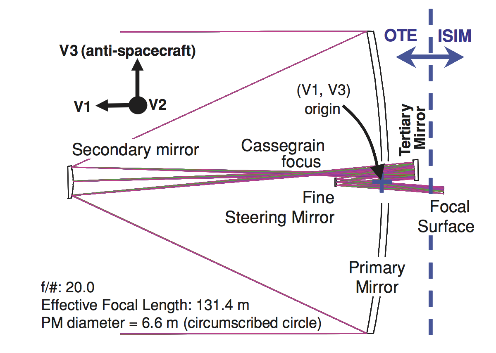

# Starseeker Modular Telescope

A modular segmented telescope concept that I designed when I was 15 years old.

Inspired by the architecture of the James Webb Space Telescope (JWST), Starseeker was conceived as an educational project aimed at exploring advanced optical systems, deployable structures and segmented mirrors using amateur-level resources.

The project combines:
- Optical design
- Mechanical CAD modelling
- Telescope engineering
- Astronomical instrumentation
- Electronics and control systems

## Project Background

The idea originated during my studies in celestial navigation at Nautical High School.

After participating in the restoration of a 30 cm Celestron telescope from the 1980s, I decided to design a larger and more ambitious system inspired by modern space telescopes, with the help of my teachers, prof. A. Stanisci and P. Garofalo.

Access to machining tools and aluminum stock allowed me to explore the complete design process, from optical calculations to mechanical modelling. Moreover, an Arduino-based controller connected to three synchronous electric motors provides pitch, yaw and elevation control. Pictures were to be taken by one active-pixel sensor. All of this composes the AOS -- Aft Optical Subsystem.

## Optical Configuration

### Primary Mirror (PM)

| Parameter | Value |
|------------|------------|
| Type | Parabolic, Segmented |
| Diameter D | 1.50 m |
| Focal Length F | 2.175 m |
| F-Ratio (F/D) | f/1.45 |
| Segments | 18 Hexagonal Segments |
| Diameter per segment d | 0.300 m |

PS. Reported diameter "d" is relative to the circumference tangent to each side of the hexagon.
The C3 segment is holed in order to make room for the AOS.

### Secondary Mirror (SM)

| Parameter | Value |
|------------|------------|
| Type | Hyperbolic, Dish |
| Diameter | 0.14 m |
| Focal Length | 1.867 m |
| F-Ratio (F/D) | f/13.3 |

### Final System

| Parameter | Value |
|------------|------------|
| Effective F-Ratio (PM + SM) | f/20 |
| Configuration | Two-Mirror Reflector (Cassegrain-type) |

## Electronics

- Arduino-based controller
- Three synchronous electric motors (pitch, yaw, elevation)
- One active-pixel sensor

## Future Work

The current AOS layout reserves space for two additional optical elements that have not yet been designed: a **tertiary mirror** and a **fine steering mirror (FSM)**. These will be developed in a future revision (modelled in Solid Edge).

This follows the JWST OTE architecture, where the aft optics system houses a fixed tertiary mirror (which re-images the primary aperture) and a movable FSM (used for fine pointing and image stabilization) downstream of the primary/secondary Cassegrain focus [JWST Telescope - OTE](https://jwst-docs.stsci.edu/jwst-observatory-hardware/jwst-telescope).
